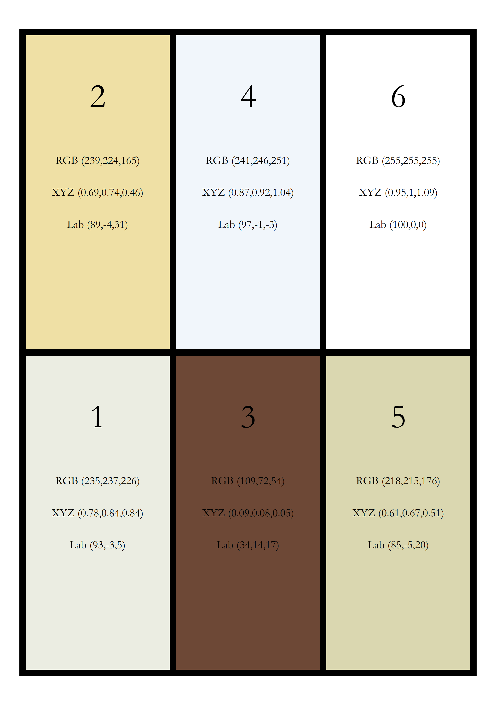

# YamSCoP: Yam Shape and Color Phenotyping Pipeline


## Overview
YamSCoP (Yam Shape and Color Phenotyping Pipeline) is designed to facilitate comprehensive phenotypic analysis of yams, focusing on both color and shape traits through a series of structured scripts. These scripts process raw image data, extract phenotypic information, and perform advanced statistical analysis to understand genetic variations and their implications on yam phenotypes. 

This project focuses on image analysis. For more information on image acquisition and prerequisites: 
[]([.](https://github.com/dcornet/YamSCoP/blob/main/Docs/RTBfoods_H.2.2_SOP_ColorCharacterizationthroughImaging_RTBfoods_2019.pdf)
  
## Scripts Description

    
### 1. Create Custom Color Chart
Generates a custom color chart from images, allowing users to select specific color ranges and create a standardized color reference for image analysis. User can customize, the number of color patch present on the chart. A dedicated patch is always kept for pure white. Some example of yam tuber flesh images are given in the [data](./data) repository.
Outputs two csv files and two .png files :
* [ChartColorValues.csv](./out/CustomColorChart/ChartColorValues.csv): provide RGB, XYZ and CIE Lab color values for created custom chart
* [ColorDifferences.csv](./out/CustomColorChart/ColorDifference.csv): provide color differences (dE2000) between each patch of the created color chart
* [TargetB5_RGB_Lab.png](./out/CustomColorChart/TargetB5_RGB_Lab.png): Image of the created chart with color value label and patch number
* [TargetB5.png](./out/CustomColorChart/TargetB5.png): Image of the created chart to be printed
[Output file path](./out/CustomColorChart)

This script logs its progress to the console and will report on incompatible chart size or potential issues with color picked from image (e.g. similar color based on dE2000 distance).

### 2. Get Picture Exif Information
Extracts EXIF information from images, which is crucial for understanding the capture conditions and camera settings used during the phenotyping process.
Ensure you have .NEF images of the desired object on your drive. Some example of yam tuber flesh images are given in the [data](./data/TuberColorSamples) repository.
Outputs a CSV file with metadata extracted from images: [Output file path](./out/Picsmeta.csv)

### 3. Convert RAW to JPG
Converts RAW image files to JPG format, preparing them for further processing and analysis in the pipeline. It uses parallel processing to speed up the conversion of multiple images simultaneously. The script reads metadata from a previously generated CSV [file](./out/Picsmeta.csv). It expects this file to contain paths to NEF images stored in the column 'SourceFile'.
Converted JPG images are outputed to this [directory](./out/JPGconvertedPics/). Each image is named according to its associated genotype and timestamp from the metadata.

### 4. Get Picture Color Chart
Analyzes images to retrieve color chart data, which is used to calibrate and correct colors in phenotyping images accurately.
simpleBlobDetector XXXXXXXXXX

### 5. Get Chart Delta E 2000
Calculates the Delta E 2000 color difference values from the color charts within images, providing a measure of color accuracy and consistency.

### 6. Get White Corrected Pictures
Applies white balancing to images based on color chart data, ensuring that colors are represented accurately in images before analysis.

### 7. Get Initial Tuber Mask
Creates initial segmentation masks for tubers in images, which are used to isolate and analyze specific tuber regions in subsequent scripts.

### 8. Get Tuber Color Matrix
Extracts color data from tuber segments and compiles this into a matrix format for statistical analysis.

### 9. Get Color Indices
Calculates various color indices from the tuber color data, providing detailed insights into the color traits of different yam varieties.

### 10. Compare Genotypes
Performs statistical comparisons between different yam genotypes based on the extracted color indices, helping to highlight phenotypic differences driven by genetic variation.

### 11. Get Index Heritability
Estimates the heritability of various color indices, providing insights into the genetic control over these traits in yams.

### 12. Identify Best Timing
Determines the optimal timing for phenotyping based on developmental stages or environmental conditions to ensure consistent and reliable data.

### 13. Basic Shape Characterization
Analyzes basic shape parameters of yams using image processing techniques to quantify morphological traits that are critical for breed characterization and selection.

## Usage
Each script is standalone but designed to be run sequentially as part of the pipeline. Detailed instructions on how to execute each script can be found at the top of the script files.

## Installation
Ensure R is installed on your machine along with the necessary packages:
* colorscience - For color science calculations and transformations.
* doParallel - For parallel computing capabilities.
* EBImage - For image processing and analysis (used in image-based scripts).
* exifr - Reads EXIF data using [ExifTool](https://exiftool.org) and returns results as a data frame.
* factoextra - For visualizing results from FactoMineR.
* FactoMineR - For exploratory and multivariate data analysis.
* farver - For high-performance color space manipulation.
* foreach - For executing looping constructs.
* ggcorrplot - For visualizing correlation matrices.
* ggpubr - For creating easily publishable ggplot2 plots.
* gridExtra - For arranging multiple grid-based plots.
* imager - For image processing and analysis.
* inti - For genetic statistics such as heritability.
* lme4 - For fitting linear mixed-effects models.
* lmerTest - To provide p-values for linear mixed-effect models.
* magick - For advanced image processing capabilities.
* multcomp - For conducting multiple comparisons.
* parallel - For support for parallel computation.
* psych - For psychological, psychometric, and personality research
* randomcoloR - For generating distinct colors for data visualization.
* Rvision - For image processing and analysis, particularly in handling and analyzing image data in R
* tidyverse - For data manipulation and visualization.


.

For CRAN package:
```R
install.packages(c("BiocManager""tidyverse", "ggpubr", "lme4", "multcomp", "lmerTest", "psych", "gridExtra", "colorscience", "farver", "inti", "ggcorrplot", "FactoMineR", "factoextra", "magick", "imager", "foreach", "doParallel", "parallel", "randomcoloR"), dependencies = TRUE)
```

For Bioconductor package:
```R
if (!require("BiocManager", quietly = TRUE))
    install.packages("BiocManager")
BiocManager::install("EBImage")
```

For Rvision: visit [RVision installing guidelines](https://swarm-lab.github.io/Rvision/articles/z1_install.html)

